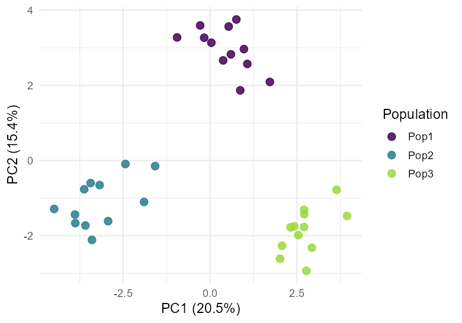
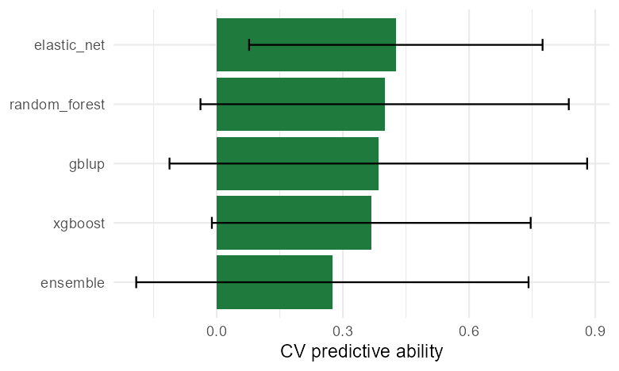

<p align="center">
  
</p>

<h1 align="center">GenoSuite</h1>

<p align="center"><strong>Modern numerical-genomics analytics — a desktop application.</strong></p>

<p align="center">
  <a href="https://github.com/mqfarooqi1/GenoSuite/releases/latest"></a>
  <a href="https://github.com/mqfarooqi1/GenoSuite/releases"></a>
  <a href="https://opensource.org/licenses/MIT"></a>
  <a href="https://mqfarooqi1.github.io/GenoSuite/"></a>
</p>

GenoSuite is a point-and-click desktop tool for multivariate analysis of genetic
marker data, in the spirit of classic packages like NTSYSpc but rebuilt for
genomic-era datasets. It runs as a **self-contained Windows application**: the
user installs a single `Setup.exe` and launches a graphical interface — no R
installation or coding required.

➡️ **[Download the installer](https://github.com/mqfarooqi1/GenoSuite/releases/latest)** ·
📖 **[Website & user manual](https://mqfarooqi1.github.io/GenoSuite/)**

<p align="center">
  
  
</p>

## Modules

| Module | What it does |
|---|---|
| **Data** | Import CSV/Excel marker tables or load a demo SNP dataset; pick ID, grouping and phenotype columns. |
| **Distance** | Genetic distance / similarity matrices: Euclidean, Manhattan, 1 − correlation, Jaccard (presence/absence), Gower. Heatmap + CSV export. |
| **Clustering** | Dendrograms by UPGMA, Ward, complete, single linkage, and neighbour-joining (NJ). Newick export. |
| **Ordination** | PCA (markers) and PCoA (distance) with scree plots, coloured by group. |
| **Mantel test** | Matrix-correlation test between two distance metrics, with permutation significance. |
| **Diversity** | Per-marker MAF, expected/observed heterozygosity, PIC, and population differentiation (Nei's Fst). |
| **Kinship** | Genomic relationship matrix (VanRaden) heatmap with relatedness/inbreeding summaries. |
| **LD** | Pairwise linkage disequilibrium (r²) heatmap and LD decay. |
| **GWAS** | Single-marker association with PC structure correction; Manhattan + QQ plots and a hit table. |
| **Prediction** | Cross-validated genomic prediction (GBLUP + elastic net, random forest, gradient boosting, stacked ensemble) and GBLUP breeding values, via [GSbench](https://github.com/mqfarooqi1/GSbench). |

## Architecture

- **GUI:** R + [Shiny](https://shiny.posit.co/) + [bslib](https://rstudio.github.io/bslib/), opened in a standalone application window.
- **Analytics:** base R, `ape`, `vegan`, and the author's own [GSbench](https://github.com/mqfarooqi1/GSbench) package.
- **Packaging:** bundled into a self-contained Windows installer (portable R + app + launcher, compiled with Inno Setup). See [`packaging/`](packaging/).

## Running from source (developers)

```r
install.packages(c("shiny", "bslib", "DT", "ggplot2", "ape", "vegan",
                   "glmnet", "ranger", "xgboost", "readxl"))
install.packages("GSbench", repos = "https://mqfarooqi1.r-universe.dev")

# from the repository root
shiny::runApp("app")
```

## Citation

If GenoSuite contributes to your work, please cite it (see
[`CITATION.cff`](CITATION.cff) or the **Cite this repository** button above):

> Farooqi, M. (2026). *GenoSuite: modern numerical-genomics analytics.* https://github.com/mqfarooqi1/GenoSuite

## License

[MIT](LICENSE) © 2026 Muhammad Farooqi. The self-contained installer also
redistributes R and several R packages under their own (GPL/MIT) licences — see
the [License page](https://mqfarooqi1.github.io/GenoSuite/license.html).
