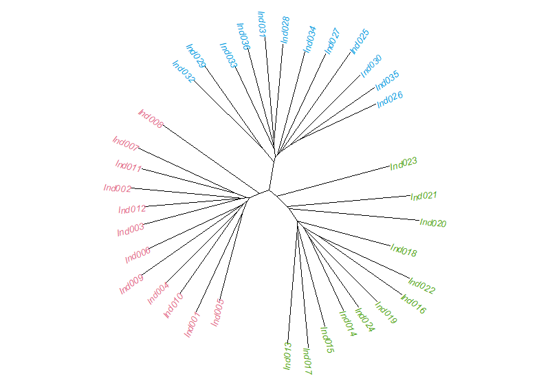
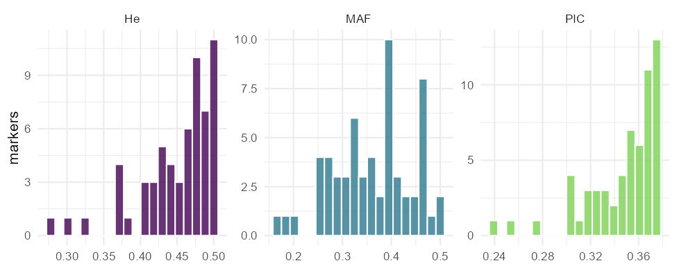
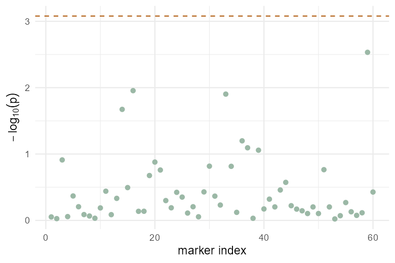

This manual covers installation, the expected data format, and every analysis
module in GenoSuite.

## Installation

### Windows installer (recommended)

1. Go to the **[Download](download.qmd)** page and download the latest
   `GenoSuite-Setup.exe`.
2. Double-click the installer and follow the prompts.
3. Launch **GenoSuite** from the Start menu. It opens in its own application
   window; all computation runs locally on your machine.

No separate R installation is required — the installer is self-contained.

### Running from source

If you have R installed:

```r
install.packages(c("shiny", "bslib", "DT", "ggplot2", "ape", "vegan",
                   "glmnet", "ranger", "xgboost"))
# install GSbench from R-universe
install.packages("GSbench", repos = "https://mqfarooqi1.r-universe.dev")

shiny::runApp("app")
```

## Data format

GenoSuite reads **CSV** or **Excel (`.xlsx`/`.xls`)** files in which:

- **Each row is one individual / accession / OTU.**
- One column holds a unique **ID** (e.g. `Ind001`).
- Optionally, one column holds a **grouping** variable (e.g. `Population`),
  used to colour plots and to compute Fst.
- Optionally, one **numeric phenotype** column (e.g. `Trait`), used for GWAS and
  genomic prediction.
- All remaining **numeric** columns are treated as **markers**, coded as allele
  dosage: `0`, `1`, or `2` (copies of the reference/alternate allele).

| ID | Population | Trait | SNP001 | SNP002 | … |
|----|-----------|-------|--------|--------|---|
| Ind001 | Pop1 | 12.4 | 0 | 2 | … |
| Ind002 | Pop1 | 9.8  | 1 | 1 | … |

On the **Data** tab, use the selectors to tell GenoSuite which columns are the
ID, group, and phenotype. Everything else is used as markers.

::: callout-tip
New to the app? Click **Load demo SNP dataset** on the Data tab. It loads 36
individuals from 3 populations, 60 SNPs, and a heritable trait — enough to try
every module immediately.
:::

## Modules

### Data

Import a CSV (or load the demo), preview it as an interactive table, and assign
the ID, grouping, and phenotype columns. These assignments drive every other
module.

### Distance

Computes a pairwise **distance / dissimilarity matrix** among individuals.

- **Metrics:** Euclidean, Manhattan (city-block), 1 − Pearson correlation,
  Jaccard (presence/absence), Gower.
- **Standardise markers** rescales each marker to mean 0 / variance 1 before
  computing Euclidean-type distances.
- The result is shown as a clustered **heatmap** and can be exported to CSV.

### Clustering

Builds a tree from the distance matrix.

- **Methods:** UPGMA (average linkage), Ward's method, complete linkage, single
  linkage, and **neighbour-joining (NJ)**.
- Hierarchical methods are drawn as dendrograms; NJ as an unrooted tree with
  tips coloured by group.
- Export the tree in **Newick** format for use in other phylogenetic software.

{width=70%}

### Ordination

Reduces the data to a few interpretable axes.

- **PCA** is computed directly on the markers.
- **PCoA** (principal coordinates) is computed on the distance matrix.
- Choose which axes to plot; points are coloured by group, with a **scree plot**
  showing the variance explained by each axis.

{width=70%}

### Mantel test

Tests the correlation between **two distance matrices** (built with two metrics)
using permutations, reporting the Mantel statistic *r* and its significance,
with a scatter plot of the paired distances.

### Diversity

Summarises genetic diversity from the allele dosages.

- **Per marker:** allele frequency, minor-allele frequency (MAF), expected
  heterozygosity (He), observed heterozygosity (Ho), and polymorphism
  information content (PIC).
- **Between groups:** Nei's **Fst** (Gst) per marker and overall (requires a
  grouping column).
- Summary value boxes, distribution histograms, a sortable table, and CSV
  export.

{width=90%}

### GWAS

Performs a **genome-wide association scan**: each marker is regressed on the
phenotype.

- **PC structure correction:** include the first *k* principal components as
  covariates to control for population structure.
- Outputs a **Manhattan plot** (with a Bonferroni significance line), a **QQ
  plot** to check calibration, and a table of the strongest associations.
- Requires a phenotype column.

{width=70%}

### Prediction

Cross-validated **genomic prediction** powered by the
[GSbench](https://github.com/mqfarooqi1/GSbench) engine.

- **Models:** GBLUP plus machine-learning predictors — elastic net, random
  forest, gradient boosting (xgboost), and a stacked ensemble.
- Runs *k*-fold cross-validation and reports **predictive ability**
  (correlation between predicted and observed values on held-out folds), with a
  bar chart and table.
- Fit a final **GBLUP** to obtain genomic estimated breeding values (**GEBVs**)
  and the estimated genomic heritability (h²); export the GEBVs to CSV.
- Requires a phenotype column.

{width=70%}

### Kinship

Computes the **genomic relationship matrix (GRM)** among individuals using the
VanRaden method (via GSbench). Shows a clustered heatmap of pairwise
relationships and the distribution of off-diagonal (relatedness) and diagonal
(1 + inbreeding) coefficients; exports the GRM to CSV. A minimum minor-allele
frequency filters out rare markers before the calculation.

### Linkage disequilibrium (LD)

Computes pairwise **r²** between markers, shown as an LD heatmap, with an **LD
decay** plot of r² against marker separation. The number of markers can be
capped for very large datasets.

## Reproducibility & citation

Analyses use established methods from the population-genetics and genomic-
prediction literature, implemented on top of base R, `ape`, `vegan`, and
`GSbench`. If GenoSuite contributes to a publication, please cite it (see the
[License](license.qmd) page).

## Support

Questions, bugs, and feature requests:
[github.com/mqfarooqi1/GenoSuite/issues](https://github.com/mqfarooqi1/GenoSuite/issues).
